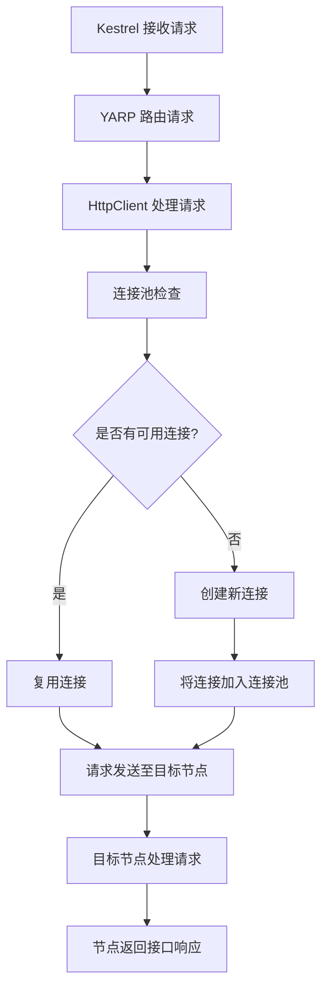

# EarthChat 全新版本

微服务设计的EarthChat，自研网关，无需服务发现，支持即可支持服务自动代理

### 流程说明：

1. **Kestrel 接收请求**：Kestrel 作为 ASP.NET Core 的 Web 服务器，接收来自客户端的 HTTP 请求。
2. **YARP 路由请求**：YARP（Yet Another Reverse Proxy）根据配置的路由规则，将请求转发。
3. **HttpClient 处理请求**：YARP 使用 `HttpClient` 来处理转发的 HTTP 请求。
4. **连接池检查**：`HttpClient` 会检查连接池中是否有可用的连接。
5. **是否有可用连接**：
   - 如果有可用连接，则复用该连接。
   - 如果没有可用连接，则创建一个新的连接，并将其加入到连接池中。
6. **请求发送至目标节点**：通过已有或新建的连接，将请求发送到目标节点。
7. **目标节点处理请求**：目标节点处理请求，并返回接口响应。
8. **返回响应给客户端**：通过 Kestrel 将目标节点的响应返回给客户端。
