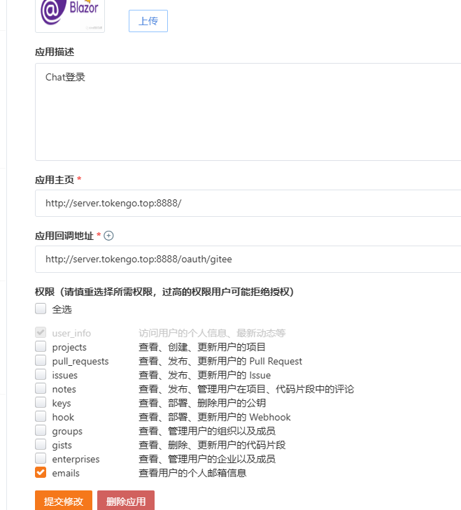
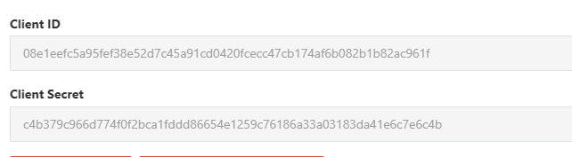
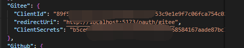

# Gitee快捷登录配置

## 申请Gitee 第三方密钥

### 第一步：

访问 [https://gitee.com/](https://gitee.com/) 并且登录账号

### 第二步：

访问第三方应用页面[这里](https://gitee.com/oauth/applications)

### 第三步：

点击创建应用 

### 第四步：

填写应用主页和回调地址  并且回去用户的邮箱信息，记得填写以下应用名称。

### 第五步：

创建完成以后得到Client Id 和Client Secret

打开Web项目，并且找到 `.env`和`.env.development`文件，修改`VITE_GITEE_ID`为刚刚得到的`Client Id`

### 第六步：

修改后端的`appsettings.json`里面的Gitee配置
 ,请注意配置的`redirectUri`需要和Gitee配置的应用回调地址一致。