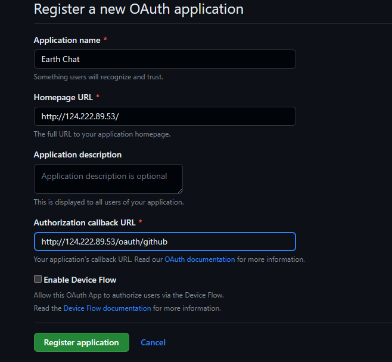
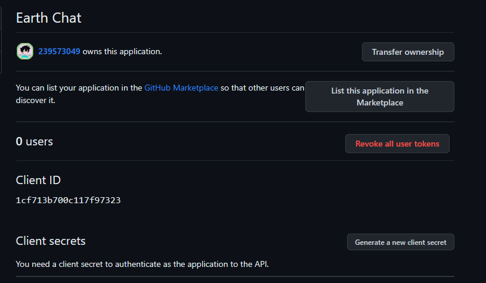
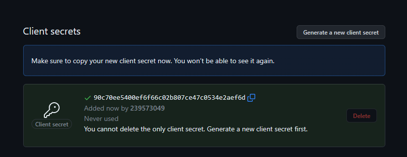
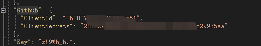

# Github快捷登录配置

## 申请Github 第三方密钥

### 第一步：

访问 https://github.com/ 并且登录

### 第二步：

进入 [OAuth Apps](https://github.com/settings/developers) 

点击`New OAuth App`按钮

填写一下信息，按照自己域名填写，支持`localhost`和`127.0.0.1`，

点击`Regiser application`

### 第三步：

创建完成以后得到Client Id 和Client Secret

点击`Generate a new client secret`得到`Client Secret`,请注意关闭页面会隐藏`Client Secret`,复制以后请保存。

### 第四步：

修改后端的`appsettings.json`里面的Github配置
,
请注意配置的`redirectUri`需要和Github配置的应用回调地址一致。

:::caution

请注意，国内服务器不一定能访问 `GithubApi`

:::
