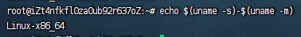
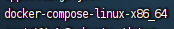

# 安装docker-compose

## window安装

window安装了docker Desktop默认安装了docker-compose

## Linux安装

Linux 上我们可以从 Github 上下载它的二进制包来使用，最新发行的版本地址：https://github.com/docker/compose/releases。

运行以下命令以下载 Docker Compose 的当前稳定版本：

```shell
sudo curl -L "https://github.com/docker/compose/releases/download/v2.22.0/docker-compose-$(uname -s)-$(uname -m)" -o /usr/local/bin/docker-compose
```

将可执行权限应用于二进制文件：

```shell
sudo chmod +x /usr/local/bin/docker-compose
```

创建软链：

```shell
sudo ln -s /usr/local/bin/docker-compose /usr/bin/docker-compose
```

测试是否安装成功：

```shell
docker-compose version
cker-compose version 1.24.1, build 4667896b
```

**注意**： 对于 alpine，需要以下依赖包： py-pip，python-dev，libffi-dev，openssl-dev，gcc，libc-dev，和 make。

## Linux离线安装

先查看当前系统需要下载的版本
打印当前系统

```shell
echo $(uname -s)-$(uname -m)
```

然后会输出一下



将下面的地址的`{name}`改成上面的`Linux-X86_64`,然后通过其他方式下载。

```shell
https://github.com/docker/compose/releases/download/v2.22.0/docker-compose-{name}
----
https://github.com/docker/compose/releases/download/v2.22.0/docker-compose-Linux-X86_64
```

下载完成以后上传到服务器,上传以后的文件



将文件移动到`/usr/local/bin/`目录下并且命名`docker-compose`

```shell
mv docker-compose-linux-x86_64  /usr/local/bin/docker-compose
```

将可执行权限应用于二进制文件：

```shell
sudo chmod +x /usr/local/bin/docker-compose
```

创建软链：

```shell
sudo ln -s /usr/local/bin/docker-compose /usr/bin/docker-compose
```

测试是否安装成功：

```shell
docker-compose version
cker-compose version 1.24.1, build 4667896b
```

**注意**： 对于 alpine，需要以下依赖包： py-pip，python-dev，libffi-dev，openssl-dev，gcc，libc-dev，和 make。