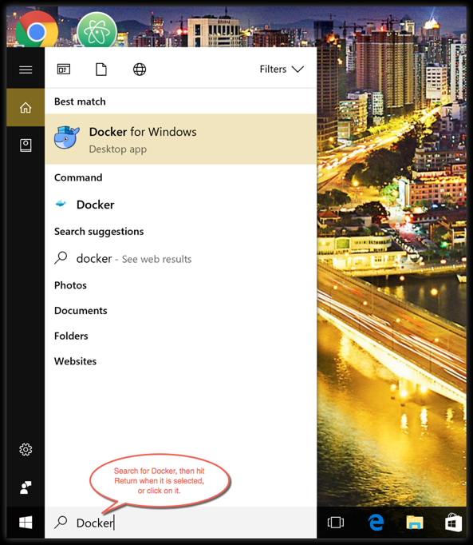

# 安装docker

## Ubuntu Docker安装

安装命令如下：

```
 curl -fsSL https://test.docker.com -o test-docker.sh
 sudo sh test-docker.sh
```

## Debian Docker 安装

安装命令如下：

```
 curl -fsSL https://get.docker.com -o get-docker.sh
 sudo sh get-docker.sh
```

## CentOS Docker 安装

安装命令如下：

```
curl -fsSL https://get.docker.com | bash -s docker --mirror Aliyun
```

## Windows Docker 安装

Docker 并非是一个通用的容器工具，它依赖于已存在并运行的 Linux 内核环境。

Docker 实质上是在已经运行的 Linux 下制造了一个隔离的文件环境，因此它执行的效率几乎等同于所部署的 Linux 主机。

因此，Docker 必须部署在 Linux 内核的系统上。如果其他系统想部署 Docker 就必须安装一个虚拟 Linux 环境。


## Win10 系统

Docker Desktop 是 Docker 在 Windows 10 和 macOS 操作系统上的官方安装方式，这个方法依然属于先在虚拟机中安装 Linux 然后再安装 Docker 的方法。

Docker Desktop 官方下载地址： [这里](https://docs.docker.com/desktop/install/windows-install/)

**注意：**此方法仅适用于 Windows 10 操作系统专业版、企业版、教育版和部分家庭版！

### 安装 Hyper-V

Hyper-V 是微软开发的虚拟机，类似于 VMWare 或 VirtualBox，仅适用于 Windows 10。这是 Docker Desktop for Windows 所使用的虚拟机。

但是，这个虚拟机一旦启用，QEMU、VirtualBox 或 VMWare Workstation 15 及以下版本将无法使用！如果你必须在电脑上使用其他虚拟机（例如开发 Android 应用必须使用的模拟器），请不要使用 Hyper-V！


程序和功能


启用或关闭Windows功能


选中Hyper-V


也可以通过命令来启用 Hyper-V ，请右键开始菜单并以管理员身份运行 PowerShell，执行以下命令：

```shell
Enable-WindowsOptionalFeature -Online -FeatureName Microsoft-Hyper-V -All
```

### 安装 Docker Desktop for Windows

点击 [Get started with Docker Desktop](https://docs.docker.com/desktop/install/windows-install/)，并下载 Windows 的版本，如果你还没有登录，会要求注册登录：


#### 运行安装文件

双击下载的 Docker for Windows Installer 安装文件，一路 Next，点击 Finish 完成安装。


安装完成后，Docker 会自动启动。通知栏上会出现个小鲸鱼的图标，这表示 Docker 正在运行。

桌边也会出现三个图标，如下图所示：

我们可以在命令行执行 docker version 来查看版本号，docker run hello-world 来载入测试镜像测试。

如果没启动，你可以在 Windows 搜索 Docker 来启动：


启动后，也可以在通知栏上看到小鲸鱼图标：


*如果启动中遇到因 WSL 2 导致地错误，请安装* [WSL 2](https://docs.microsoft.com/zh-cn/windows/wsl/install-win10)*。*

安装之后，可以打开 PowerShell 并运行以下命令检测是否运行成功：

```shell
docker run hello-world
```

在成功运行之后应该会出现以下信息：

