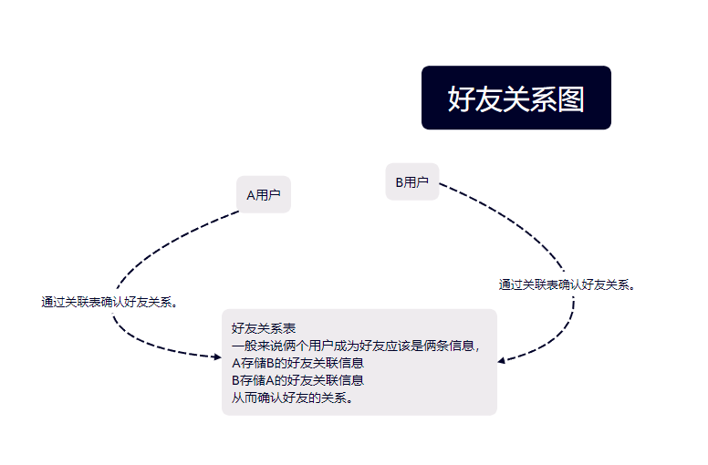

# 好友关系原理图



## 好友关系

所谓的好友关系只是一张关联表将俩个用户进行绑定关联，他们就成为了好友的关系。

## 好友表设计模型

好友表模型设计

```csharp
/// <summary>
/// 好友表
/// </summary>
public class Friend : Entity<Guid>
{
    /// <summary>
    /// 好友Id
    /// </summary>
    public Guid FriendId { get; set; }

    /// <summary>
    /// 本人Id
    /// </summary>
    public Guid SelfId { get; set; }

    /// <summary>
    /// 好友备注
    /// </summary>
    public string Remark { get; set; }

    /// <summary>
    /// 关联群聊id
    /// </summary>
    public Guid GroupId { get; set; }
}
```

好友申请表设计

```csharp
public class FriendRequest : FullAggregateRoot<Guid,Guid>
{
    /// <summary>
    /// 申请描述
    /// </summary>
    public string Description { get; set; }

    /// <summary>
    /// 申请状态
    /// </summary>
    public FriendState State { get; set; }

    /// <summary>
    /// 申请人
    /// </summary>
    public Guid RequestId { get; set; }

    /// <summary>
    /// 被申请人
    /// </summary>
    public Guid BeAppliedForId { get; set; }

    /// <summary>
    /// 申请时间
    /// </summary>
    public DateTime ApplicationDate { get; set; }

}
```

## 实现逻辑讲解

实现好友这个关系并不是默认存在的，比如QQ设计的好友关系，当你想要成为别人的好友，你需要先向他发起好友申请
我们可以使用`FriendRegistrationCommand`命令创建一个好友请求的事件，这完成了第一步，发起好友申请
但申请了并不是真的好友关系，还需要被申请人同意才能申请，并且被申请人也可以拒绝，
我们可以打开`Chat.Service/Application/Users/UserCommandHandler.cs`文件，找到`FriendHandle`方法，这个方法是处理好友申请，传递用户的同意或拒绝，当用户同意好友申请，我们需要发送一条通知给申请人，并且新增好友关系表，
增加完成，还需要将当前用户增加到`signalR`中的的Group，本身的设计在用户连接`signalR`的时候会在redis中添加一个
key为`Constant.Connections`+用户id，在这里将存储用户的所有的`signalR`连接id，我们需要获取这些id然后添加到Group中，
申请人也需要添加，并且提交通知到申请人，然后前端会实时刷新列表。
