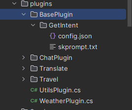

# 智能助手服务

当前文档对应`src/assistant/Chat.SemanticServer`项目

首先我们介绍一下`Chat.SemanticServer`的技术架构

## SemanticKernel 是什么？

Semantic Kernel是一个SDK，它将OpenAI、Azure OpenAI和Hugging Face等大型语言模型（LLMs）与传统的编程语言如C＃、Python和Java集成在一起。Semantic Kernel通过允许您定义可以在几行代码中链接在一起的插件来实现这一目标。

## 如何集成使用SemanticKernel

以下是添加`IKernel`,`OpenAIOptions.Model`和`OpenAIOptions.Key`在一开始使用了`builder.Configuration.GetSection("OpenAI").Get<OpenAIOptions>();`绑定。对应配置文件,`OpenAIChatCompletion`则是用于直接请求OpenAI。

```json
"OpenAI": {
    "Key": "",
    "Endpoint": "",
    "Model": "gpt-3.5-turbo"
  }
```

```csharp
builder.Services.AddTransient<IKernel>((services) =>
{
    var httpClientFactory = services.GetRequiredService<IHttpClientFactory>();
    return Kernel.Builder
        .WithOpenAIChatCompletionService(
            OpenAIOptions.Model,
            OpenAIOptions.Key,
            httpClient: httpClientFactory.CreateClient("ChatGPT"))
        .Build();
}).AddSingleton<OpenAIChatCompletion>((services) =>
{
    var httpClientFactory = services.GetRequiredService<IHttpClientFactory>();
    return new OpenAIChatCompletion(OpenAIOptions.Model, OpenAIOptions.Key,
        httpClient: httpClientFactory.CreateClient("ChatGPT"));
});
```

在项目中存在`plugins`文件夹，这是提供的插件目录，在`BasePlugin`目录下存在一个识别意图的插件。



`config.json`对应当前插件的一些参数配置，

```json
{
  "schema": 1,
  "type": "completion",
  "description": "获取用户的意图。",
  "completion": {
    "max_tokens": 500,
    "temperature": 0.0,
    "top_p": 0.0,
    "presence_penalty": 0.0,
    "frequency_penalty": 0.0
  },
  "input": {
    "parameters": [
      {
        "name": "input",
        "description": "用户的请求。",
        "defaultValue": ""
      },
      {
        "name": "history",
        "description": "对话的历史。",
        "defaultValue": ""
      },
      {
        "name": "options",
        "description": "可供选择的选项。",
        "defaultValue": ""
      }
    ]
  }
}
```

`skprompt.txt`则是当前插件使用的`prompt`

## 加载插件

在这里我们注入了`IKernel`

```csharp
    private readonly IKernel _kernel;
    private readonly IHttpClientFactory _httpClientFactory;
    private readonly RedisClient _redisClient;
    private readonly ILogger<IntelligentAssistantHandle> _logger;
    private readonly OpenAIChatCompletion _chatCompletion;

    public IntelligentAssistantHandle(IKernel kernel, RedisClient redisClient,
        ILogger<IntelligentAssistantHandle> logger, IHttpClientFactory httpClientFactory,
        OpenAIChatCompletion chatCompletion)
    {
        _kernel = kernel;
        _redisClient = redisClient;
        _logger = logger;
        _httpClientFactory = httpClientFactory;
        _chatCompletion = chatCompletion;

        _redisClient.Subscribe(nameof(IntelligentAssistantEto),
            ((s, o) => { HandleAsync(JsonSerializer.Deserialize<IntelligentAssistantEto>(o as string)); }));
    }
```

然后准备加载插件。

```csharp

//对话摘要  SK.Skills.Core 核心技能
_kernel.ImportSkill(new ConversationSummarySkill(_kernel), "ConversationSummarySkill");

// 插件根目录
var pluginsDirectory = Path.Combine(Directory.GetCurrentDirectory(), "plugins");

// 这个是添加BasePlugin目录下面的所有插件，会自动扫描
var intentPlugin = _kernel
                .ImportSemanticSkillFromDirectory(pluginsDirectory, "BasePlugin");

// 这个是添加Travel目录下面的所有插件，会自动扫描
var travelPlugin = _kernel
                .ImportSemanticSkillFromDirectory(pluginsDirectory, "Travel");

// 这个是添加ChatPlugin目录下面的所有插件，会自动扫描
var chatPlugin = _kernel
                .ImportSemanticSkillFromDirectory(pluginsDirectory, "ChatPlugin");

// 这个是添加WeatherPlugin类插件，并且给定插件命名WeatherPlugin
var getWeather = _kernel.ImportSkill(new WeatherPlugin(_httpClientFactory), "WeatherPlugin");

```

使用插件，首先我们创建了一个`ContextVariables`，`input`则是`GetIntent`插件中的的`{{$input}}`，`options`则对应`{{$options}}`，`getIntentVariables`则将替换对应的`prompt`中响应的参数。

```csharp
var getIntentVariables = new ContextVariables
            {
                ["input"] = value,
                ["options"] = "Weather,Attractions,Delicacy,Traffic" //给GPT的意图，通过Prompt限定选用这些里面的
            };
string intent = (await _kernel.RunAsync(getIntentVariables, intentPlugin["GetIntent"])).Result.Trim();
```

`plugins/BasePlugin/GetIntent/skprompt.txt`内容

```tex
{{ConversationSummarySkill.SummarizeConversation $history}}
用户: {{$input}}

---------------------------------------------
提供用户的意图。其意图应为以下内容之一: {{$options}}

意图: 
```

意图识别完成以后，当执行完成`GetIntent`，`intent`相应会根据`options`中提供的参数返回与之匹配的参数，

然后下面的代码将根据返回的意图进行实际上的操作，或加载相应的插件，比如当`intent`返回`Weather`，则首先从`chatPlugin`中使用[Weather](#weather的prompt)插件，并且传递当前用户输入内容，在这里将提取用户需要获取天气的城市。

完成返回以后将在使用`MathFunction = _kernel.Skills.GetFunction("WeatherPlugin", "GetWeather")`的方式获取[WeatherPlugin](#weatherplugin获取天气插件)插件的`GetWeather`方法，并且将得到的参数传递到`_kernel.RunAsync`执行的时候则会掉用`GetWeather`方法，这个时候会由插件返回的json在组合成定义的模板消息进行返回，就完成了调用。

```csharp
            ISKFunction MathFunction = null;
            SKContext? result = null;

            //获取意图后动态调用Fun
            if (intent is "Attractions" or "Delicacy" or "Traffic")
            {
                MathFunction = _kernel.Skills.GetFunction("Travel", intent);
                result = await _kernel.RunAsync(value, MathFunction);
            }
            else if (intent is "Weather")
            {
                var newValue = (await _kernel.RunAsync(new ContextVariables
                {
                    ["input"] = value
                }, chatPlugin["Weather"])).Result;
                MathFunction = _kernel.Skills.GetFunction("WeatherPlugin", "GetWeather");
                result = await _kernel.RunAsync(newValue, MathFunction);

                if (!result.Result.IsNullOrWhiteSpace())
                {
                    if (result.Result.IsNullOrEmpty())
                    {
                        await SendMessage("获取天气失败了！", item.RevertId, item.Id);
                        return;
                    }

                    var weather = JsonSerializer.Deserialize<GetWeatherModule>(result.Result);
                    var live = weather?.lives.FirstOrDefault();
                    await SendMessage(WeatherTemplate
                        .Replace("{province}", live!.city)
                        .Replace("{weather}", live?.weather)
                        .Replace("{temperature_float}", live?.temperature_float)
                        .Replace("{winddirection}", live?.winddirection)
                        .Replace("{humidity}", live.humidity), item.RevertId, item.Id);
                    return;
                }
            }
            else
            {
                var chatHistory = _chatCompletion.CreateNewChat();
                chatHistory.AddUserMessage(value);
                var reply = await _chatCompletion.GenerateMessageAsync(chatHistory);
                
                return;
            }

```

### Weather的prompt

```tex
我会给你一句话，你需要找到需要获取天气的城市，如果存在时间也提供给我：
{{$input}}

仅返回结果，除此之外不要有多余内容，按照如下格式：
{
    "city":"",
    "time":""
}
```

### WeatherPlugin获取天气插件

```csharp

/// <summary>
/// 获取天气插件
/// </summary>
public class WeatherPlugin
{
    private static List<AdCode>? _codes;

    static WeatherPlugin()
    {
        var path = Path.Combine(AppContext.BaseDirectory, "adcode.json");
        if (File.Exists(path))
        {
            var str = File.ReadAllText(path);
            _codes = JsonSerializer.Deserialize<List<AdCode>>(str);
        }

        _codes ??= new List<AdCode>();
    }

    private readonly IHttpClientFactory _httpClientFactory;

    public WeatherPlugin(IHttpClientFactory httpClientFactory)
    {
        _httpClientFactory = httpClientFactory;
    }

    [SKFunction, Description("获取天气")]
    [SKParameter("input", "入参")]
    public async Task<string> GetWeather(SKContext context)
    {
        var weatherInput = JsonSerializer.Deserialize<WeatherInput>(context.Result);
        var value = _codes.FirstOrDefault(x => x.name.StartsWith(weatherInput.city));
        if (value == null)
        {
            return "请先描述指定城市！";
        }

        var http = _httpClientFactory.CreateClient(nameof(WeatherPlugin));
        var result = await http.GetAsync(
            "https://restapi.amap.com/v3/weather/weatherInfo?key={高德天气api的key}&extensions=base&output=JSON&city=" +
            value.adcode);

        if (result.IsSuccessStatusCode)
        {
            return await result.Content.ReadAsStringAsync();
        }
        
        return string.Empty;
    }
}

public class WeatherInput
{
    public string city { get; set; }
    public string time { get; set; }
}

public class AdCode
{
    public string name { get; set; }

    public string adcode { get; set; }

    public string citycode { get; set; }
}
```
