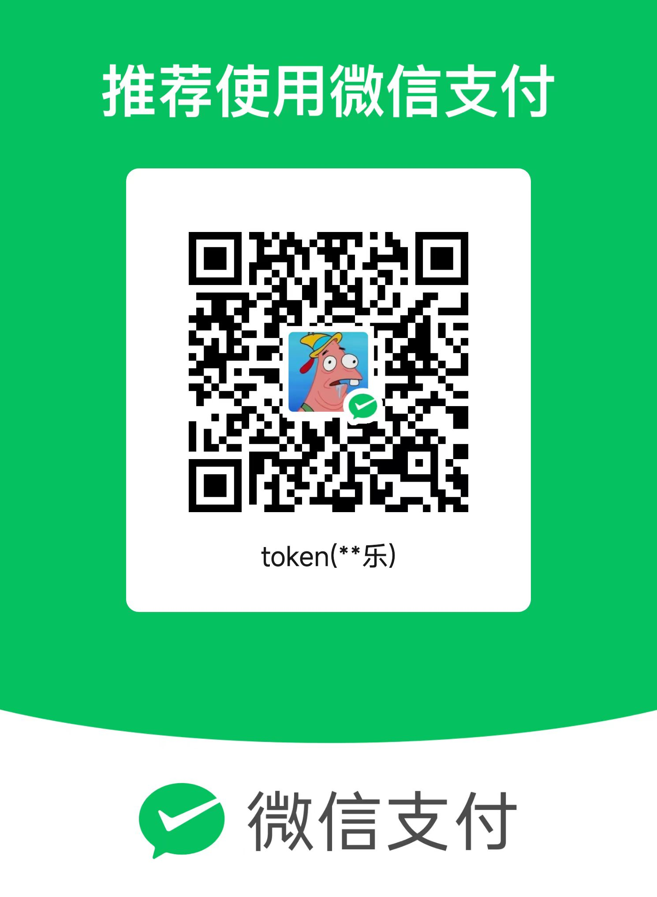

# Chat Docs

## 项目介绍

基于SignalR实现的Chat聊天，支持横向扩展，以便支撑上万用户同时在线聊天。
采用DDD领域驱动设计模式，CQRS架构模式，分离读写模型，架构更清晰，并且维护成本更低。

### 后端架构设计

- ASP.NET Core 7
- PostgreSQL
- Redis
- [MasaFramework](https://docs.masastack.com/framework/concepts/overview)
- DDD领域驱动设计模式
- CQRS架构模式
- SignalR （实现对话并且使用redis支持横向扩展）

### 前端架构

- React
- [Semi UI](https://semi.design/zh-CN/start/getting-started)
- Axios
- Vite
- Avalonia

## 后端环境变量配置

当环境变量为空则读取配置文件的值

| 环境变量名称            | 环境变量值                                 |
| ----------------------- | ------------------------------------------ |
| REDIS_CONNECTION_STRING | Redis连接字符串                            |
| SQLTYPE                 | 数据库类型 `sqlite`|[`pgsql`|`postgresql`] |
| CONNECTION_STRING       | 数据库连接字符串                           |

## 项目使用

- [Docker compose部署](./DevOps/Install.md)
- [Window 单机部署](./DevOps/Window-DevOps.md)
- [数据迁移](./DevOps/Migration.md)
- [好友关系设计](./Service/Friend-Chart.md)

## 技术交流

qq群：737776595

### 赞助

您的赞助是我的最大动力。

